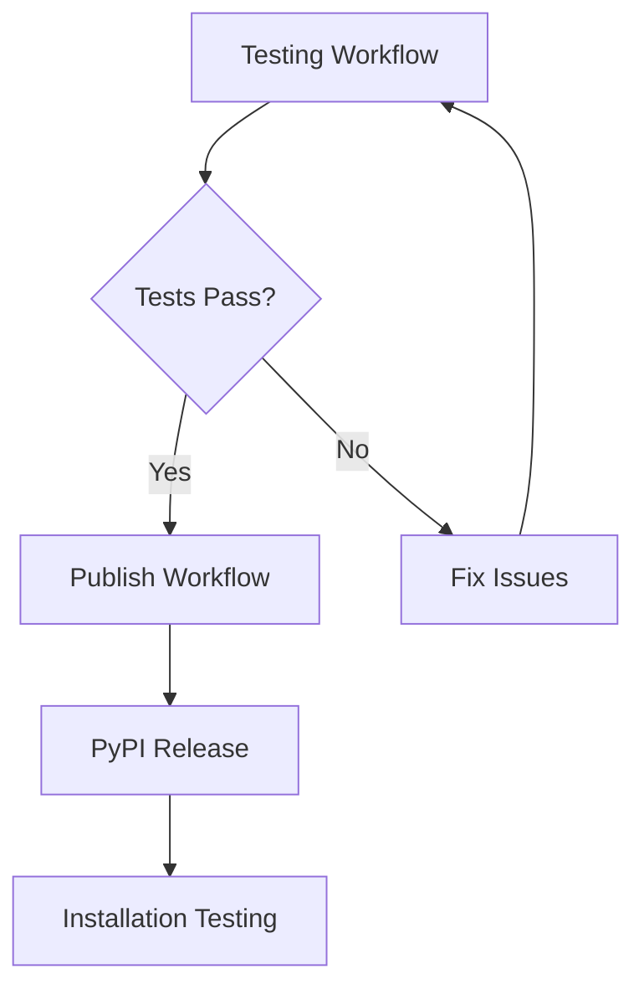

# GitHub Workflows Documentation

This repository uses a modular workflow structure with clear separation of concerns between testing and publishing.

## Workflow Structure

### 🧪 Testing Workflow (`.github/workflows/test.yml`)

**Purpose**: Comprehensive testing and quality assurance

**Triggers**:
- Push to `main` or `develop` branches
- Pull requests to `main` or `develop` branches  
- Manual dispatch

**What it does**:
- **Matrix Testing**: Tests across Python 3.10, 3.11, 3.12
- **Code Quality**: Linting, formatting, type checking
- **Test Execution**: Unit, integration, CLI, and MCP tests
- **Coverage Reporting**: Generates coverage reports with 80% threshold
- **Security Checks**: Dependency scanning and code security analysis
- **Package Building**: Verifies package builds correctly
- **Artifact Upload**: Saves coverage reports and build artifacts

**Jobs**:
1. `test` - Main test matrix across Python versions
2. `security` - Security and dependency checks
3. `build-test` - Package building verification
4. `test-summary` - Consolidated test results

### 📦 Publish to PyPI Workflow (`.github/workflows/publish.yml`)

**Purpose**: Package building and publishing to PyPI

**Triggers**:
- Push tags matching `v*` (e.g., `v1.0.3`)
- Manual dispatch with options

**What it does**:
- **Test Verification**: Ensures tests have been run (with override option)
- **Quick Validation**: Lightweight smoke tests
- **Package Building**: Creates wheel and source distributions
- **Publishing**: Uploads to PyPI or TestPyPI
- **Release Creation**: Creates GitHub releases with changelogs
- **Installation Testing**: Verifies published package installs correctly

**Jobs**:
1. `wait-for-tests` - Ensures testing requirements are met
2. `validate` - Quick validation checks
3. `build` - Package building and verification
4. `publish-test` - TestPyPI publishing (manual)
5. `publish` - PyPI publishing (tags or manual)
6. `test-published` - Installation verification
7. `notify` - Publication summary

## Usage Guide

### For Development and Pull Requests

The **Testing** workflow runs automatically:

```bash
# These actions trigger testing:
git push origin main                    # Push to main
git push origin develop                # Push to develop  
# Opening/updating pull requests also triggers tests
```

Manual testing:
```bash
# Go to GitHub Actions → Testing → Run workflow
# Or use GitHub CLI:
gh workflow run test.yml
```

### For Releases

1. **First, ensure tests pass**:
   ```bash
   # Run tests manually or push to main
   gh workflow run test.yml
   ```

2. **Create and push a version tag**:
   ```bash
   git tag v1.0.3
   git push origin v1.0.3
   ```
   This automatically triggers the publish workflow.

3. **Manual publishing** (for testing):
   ```bash
   # Go to GitHub Actions → Publish to PyPI → Run workflow
   # Options:
   # - test_pypi: true (publish to TestPyPI)
   # - skip_existing: true (skip if version exists)
   # - force_publish: true (skip test verification - not recommended)
   ```

## Workflow Dependencies



The publish workflow includes checks to ensure testing has been performed, but can be overridden if needed.

## Configuration

### Testing Configuration

- **Coverage Threshold**: 80% (configurable via workflow input)
- **Python Versions**: 3.10, 3.11, 3.12
- **Test Categories**: unit, integration, mcp, cli, api
- **Security Tools**: safety, bandit

### Publishing Configuration

- **PyPI**: Production releases
- **TestPyPI**: Testing releases
- **Environments**: Configured for trusted publishing
- **Release Notes**: Automatic from CHANGELOG.md

## File Locations

```
.github/workflows/
├── test.yml          # Comprehensive testing
├── publish.yml       # PyPI publishing
└── [future]          # Additional workflows as needed
```

## Best Practices

### Development Workflow

1. **Create feature branch**
2. **Make changes**
3. **Run tests locally**: `pytest tests/ -v --cov=src/vultr_dns_mcp`
4. **Push and create PR** (triggers testing)
5. **Merge after tests pass**

### Release Workflow

1. **Update version** in `pyproject.toml`
2. **Update CHANGELOG.md**
3. **Commit changes**: `git commit -m "Prepare v1.0.3 release"`
4. **Push to main**: `git push origin main` (triggers testing)
5. **Tag release**: `git tag v1.0.3 && git push origin v1.0.3` (triggers publishing)

### Emergency/Hotfix Workflow

If you need to publish without full testing (not recommended):

```bash
# Use force_publish option in manual workflow dispatch
gh workflow run publish.yml -f force_publish=true
```

## Monitoring and Debugging

### Check Test Status
- **GitHub Actions tab**: View test results
- **Pull Request checks**: See test status on PRs
- **Coverage reports**: Download from workflow artifacts

### Check Publish Status
- **PyPI package page**: https://pypi.org/project/vultr-dns-mcp/
- **GitHub releases**: See created releases
- **Workflow summaries**: Detailed status in GitHub Actions

### Common Issues

1. **Tests failing**: Check the Testing workflow logs
2. **Publish blocked**: Ensure tests have run successfully
3. **Version mismatch**: Verify tag matches pyproject.toml version
4. **Coverage too low**: Add more tests or adjust threshold

## Security Considerations

- **Trusted Publishing**: Uses OIDC tokens instead of API keys
- **Environment Protection**: PyPI publishing requires approval
- **Dependency Scanning**: Automatic security checks on dependencies
- **Code Scanning**: Static analysis for security issues

This modular approach provides better separation of concerns, faster feedback, and more reliable releases.
